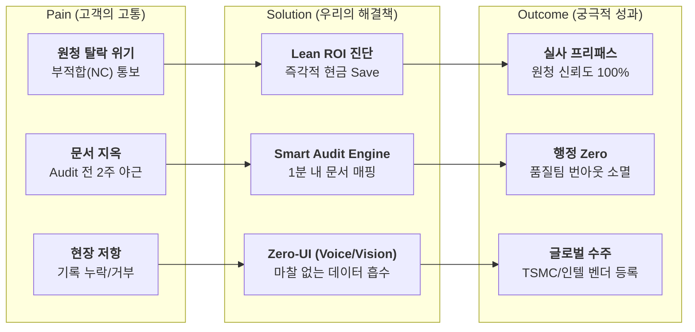

# 💎 PRO ILI SMART 전략적 종합 마스터플랜 (Comprehensive Strategic Foundation Plan)

본 문서는 반도체 소부장 SME 초기 창업자를 위한 비즈니스 리서치 통합 마스터플랜입니다. PORTERS 5 FORCES, 경쟁사 분석, 가치사슬, KSF, TAM-SAM-SOM, 페르소나, CJM, AOS-DOS, JTBD 등 10개 핵심 리서치 결과를 유기적으로 통합하여, 누구에게 어떤 가치를 제공하고 어떻게 MVP를 성공시킬 것인지 정의합니다.

---

### 📑 핵심 목차 및 요약 (Table of Contents & Summary)

| No. | 섹션명 | 핵심 내용 요약 |
| :---: | :--- | :--- |
| 1 | **Pain Solution Outcome 핵심흐름도** | 고객의 '문서 지옥' 및 '원청 실사 위기'를 'Smart Audit/Zero-UI'로 해결하는 직관적 흐름 정의 |
| 2 | **타겟 & 문제분석** | 국내 450여 개 반도체 소부장 SME를 타겟으로, 연간 수조 원 규모의 '가짜 혁신 비용' 정조준 |
| 3 | **AOS-DOS 결합 매트릭스** | 절박함(AOS)과 시장 가치(DOS)가 수렴하는 'Audit 자동화' 및 '긴급 NC 대응' 최우선 기회 확정 |
| 4 | **JTBD 요약카드** | 박품질(팀장), 정태식(대표) 등 핵심 페르소나의 구체적 고충 및 성취 목표(Outcome) 압축 |
| 5 | **Value Proposition Sheet** | Zero-Paperwork, Zero-UI, Zero-CapEx Trap의 3대 본원 경쟁력을 통한 파괴적 역포지셔닝 |
| 6 | **수익 구조 설계** | 정부 보조금(85%) 매핑을 통한 초기 도입 허들 제거 및 데이터 축적 기반 SaaS 구독 모델 |
| 7 | **전략적 제안** | 가치 분석가의 3가지 핵심 조언 (역포지셔닝, 쐐기 전략, 레그테크 권력화) |
| 8 | **MVP 제품 비전 및 포지셔닝** | "원청 실사 프리패스 통과망" 정체성 확립 및 북극성 지표(Audit 성공 시간 단축) 설정 |
| 9 | **Job Feature Map & MVP 기능 명세** | 6대 핵심 High-Priority 기능을 중심으로 한 리스크 대응 및 개발 난이도 관리 가이드 |
| 10 | **MVP 성공 측정 기준 & NextSteps** | 8주 스프린트를 통한 지표 검증 체계 및 Go/Pivot 의사결정 마일스톤 |

---

## 🚀 1. Pain Solution Outcome 핵심흐름도 (PSO Flow)

고객이 처한 가장 절박한 위기 상황에서 출발하여, PRO ILI만의 독보적 솔루션을 통해 도출되는 정량적 성과 흐름입니다.

---

## 🎯 2. 타겟 & 문제분석 (Target & Problem Analysis)

| 항목 | 상세 내용 | 데이터 근거 |
| :--- | :--- | :--- |
| **핵심 타겟** | 국내 반도체 소부장 **50~500인 SME** (특히 해외 팹 직납 기업) | SAM: 국내 약 2,000억원 규모 |
| **본질적 문제** | IT 시스템을 깔아도 현장은 입력을 거절하고, 종이 만드는 '가짜 혁신'에 매몰됨 | 80%가 비용/인력 부족으로 포기 |
| **가시적 Pain** | 원청 실사 직전 2주간 라인 중단 및 품질팀 전사 집중 (번아웃) | 1회 감사 당 120시간 수기 투입 |
| **재무적 손실** | 불량 및 대기 시간 등 '히든 팩토리' 비용이 영업이익의 20~30% 잠식 | 국내 연간 7~17조원 규모 소실 |

---

## 📊 3. AOS-DOS 결합 매트릭스 (Market Opportunity Mapping)

고객의 절박함(AOS)과 비즈니스 확장 가치(DOS)를 결합하여 개발 우선순위를 도출했습니다.

| 우선순위 | 기회 영역 | AOS (니즈) | DOS (가치) | 전략적 의미 |
| :---: | :--- | :---: | :---: | :--- |
| **1순위** | **Audit 대응 자동화** | 4.0 | 4.0 | MVP의 심장 (Most Desired) |
| **1순위** | **긴급 NC 시정 조치** | 4.0 | 3.2 | 시장 진입 쐐기 (Entry Wedge) |
| **2순위** | **현장 입력 혁신 (Zero-UI)** | 3.2 | 2.4 | 데이터 해자 구축 (Moat) |
| **3순위** | **글로벌 벤더 등록 가속** | 3.0 | 2.4 | 고수익 선별 타겟 (Expansion) |

---

## 🏷️ 4. JTBD 요약카드 (핵심 과업 통합)

| # | 페르소나 | Situation (상황) | Job Statement (핵심 과업) | Desired Outcome (기대 성과) |
| :---: | :--- | :--- | :--- | :--- |
| **1** | **박품질** (팀장) | 원청 실사관이 현장에 도착함 | 1분 내 완벽한 디지털 증빙 제시 | 오딧 성공 및 야근 90% 단축 |
| **2** | **정태식** (CEO) | 부적합 통보로 계약 파기 위기 | 90일 내 신뢰 회복 증빙 생성 | 거래 유지 및 폐업 위기 차단 |
| **3** | **오반장** (현장) | 장갑 끼고 기름 묻은 채 작업 중 | 사진/음성으로 마찰 없이 기록 | 데이터 누락 95% 방어 |
| **4** | **김도약** (CEO) | 해외 팹(TSMC 등) 견적 제출 중 | 글로벌 스탠다드 체계 증명 | 해외 벤더 등록 및 수주율 30%↑ |

---

## 💎 5. Value Proposition Sheet (핵심가치 제안)

당사는 기술적 스펙 경쟁을 거부하고, 현장의 '물리적 마찰'과 '정신적 피로'를 제거하는 데 집중합니다.

| 핵심 기둥 (Pillars) | 상세 내용 및 경쟁 차별점 | 가치 창출 방식 |
| :--- | :--- | :--- |
| **Zero-Paperwork** | 실시간 데이터를 ISO 규제 양식으로 즉각 매핑. 수동 엑셀 조합 영구 종식. | 120시간 행정 노동 ➔ 1분 자동화 |
| **Zero-UI** | 장갑을 벗거나 화면을 터치할 필요 없음. Edge 기반 비전/음성으로 데이터 자동 흡수. | 현장 저항 0% ➔ 데이터 정합성 95% |
| **Zero-CapEx Trap** | 수억 원의 서버 구축 대신 'Lean 진단'으로 낭비부터 잡아 초기 비용 상쇄. | 선지출 0원 ➔ 1주 내 현금 절감 증명 |

---

## 💰 6. 수익 구조 설계 (Revenue Model)

1.  **초기 진입 (High Push):** '긴급 NC 구조 패키지' 또는 '무상 Lean 진단'을 통해 고객의 거부감 해소.
2.  **보조금 연계 (Safety Net):** 중소기업 혁신바우처 등 정책 자금(85%) 매핑 ➔ **월 체감가 12만 원** 수준으로 설정.
3.  **구독 모델 (Recurring):** 데이터 축적량 및 처리량에 따른 계층별(Tiered) SaaS 구독료 징수 (Standard/Premium/Enterprise).
4.  **수익성 지표:** LTV $18,200 / CAC $2,000 ➔ **LTV:CAC 비율 9.1:1**의 고수익 구조.

---

## 💡 7. 전략적 제안: 가치 분석가의 3가지 조언

1.  **"역포지셔닝으로 승부하십시오"**: 0.01% 정확도나 예쁜 대시보드를 파는 IT 벤더 리그를 떠나십시오. 오직 '실사 통과'와 '현금 절감'이라는 원초적 가치에만 집착하십시오.
2.  **"품질팀장을 당신의 챔피언으로 만드십시오"**: 가장 고통받는 박품질 팀장의 '문서 노가다'를 해결해 주는 순간, 그가 사내에서 당신의 솔루션을 가장 강력하게 영업하는 내부 판매원이 될 것입니다.
3.  **"레그테크(RegTech) 권력을 선점하십시오"**: 단순 툴이 아니라, '이 솔루션을 쓰면 삼성/SK가 데이터 무결성을 보증한다'는 시장의 마크를 취득하는 순간, 경쟁은 영구히 종료됩니다.

---

## 🎯 8. MVP 제품 비전 및 포지셔닝

*   **MVP 정의**: "현장의 Raw-Data를 수집하여 1분 내에 ISO 오딧 증빙 리포트를 뽑아내는 핵심 파이프라인"
*   **북극성 지표 (NSM)**: **'Audit 리포트 생성 소요 시간'** (현재 120시간 ➔ 목표 1분)
*   **Must-Have 스펙**: 
    - ① 비전/음성 기반 Zero-UI 수집기
    - ② ISO Smart Audit 자동 매핑 엔진
    - ③ 낭비 절감액(COPQ) 시각화 대시보드
    - ④ 데이터 무결성 보증용 타임스탬프 로그

---

## 🗺️ 9. Job Feature Map & MVP 기능 명세

| 기능명 | 주요 Job (JTBD) | 우선순위 | 난이도 | 리스크 대응 |
| :--- | :--- | :---: | :---: | :--- |
| **Smart Audit 엔진** | #01 감사대응, #04 행정제로 | **High** | 4 | 원청별 양식 다양성 ➔ 템플릿 커스텀화 |
| **Zero-UI 수집기** | #06 현장입력 | **High** | 4 | 현장 소음/광원 ➔ Edge 보정 알고리즘 |
| **Lean 진단 도구** | 가치증명, 가설검증 | **High** | 3 | 정량화 오류 ➔ 표준 ROI 산출 로직 |
| **긴급 NC 패키지** | #02 위기회복 | **High** | 3 | 데이터 부재 ➔ 합법적 역추적 엔진 |
| **XAI 신호등 뷰어** | 무결성 보증, 신뢰확보 | Mid | 4 | 로직 복잡성 ➔ 타임스탬프 아카이빙 |

---

## 📈 10. MVP 성공 측정 기준 & NextSteps

### 10.1 성공 수용 기준 (Criteria)
*   **GO**: 감사 준비 시간 **90% 이상 단축** 성공 및 시범 사업장 **ROI 7일 내** 증명 시.
*   **PIVOT**: 현장 입력 저항이 여전할 경우 ➔ 음성 대신 극단적 '단축 버튼 UI'로 폴백 전환.
*   **STOP**: 원청 심사관이 디지털 증빙 자체를 거부할 경우 ➔ 타겟 시장 및 규제 전략 전면 재검토.

### 10.2 팀별 Next Steps (Action Items)
- **개발팀**: 4주 내 Zero-UI 코어 및 Smart Audit 엔진 프로토타입 완성.
- **사업팀**: 2주 내 PoC 대상 기업(반도체 소부장 SME 2개사) 협의 및 계약 확정.
- **기획팀**: 원청 실사단 인터뷰를 통한 '데이터 무결성' 법적 허용 범위 최종 확정.

---

*본 전략 계획은 데이터와 현장의 목소리를 기반으로 설계되었습니다. 즉각적인 MVP 스프린트 착수를 제안합니다.*
