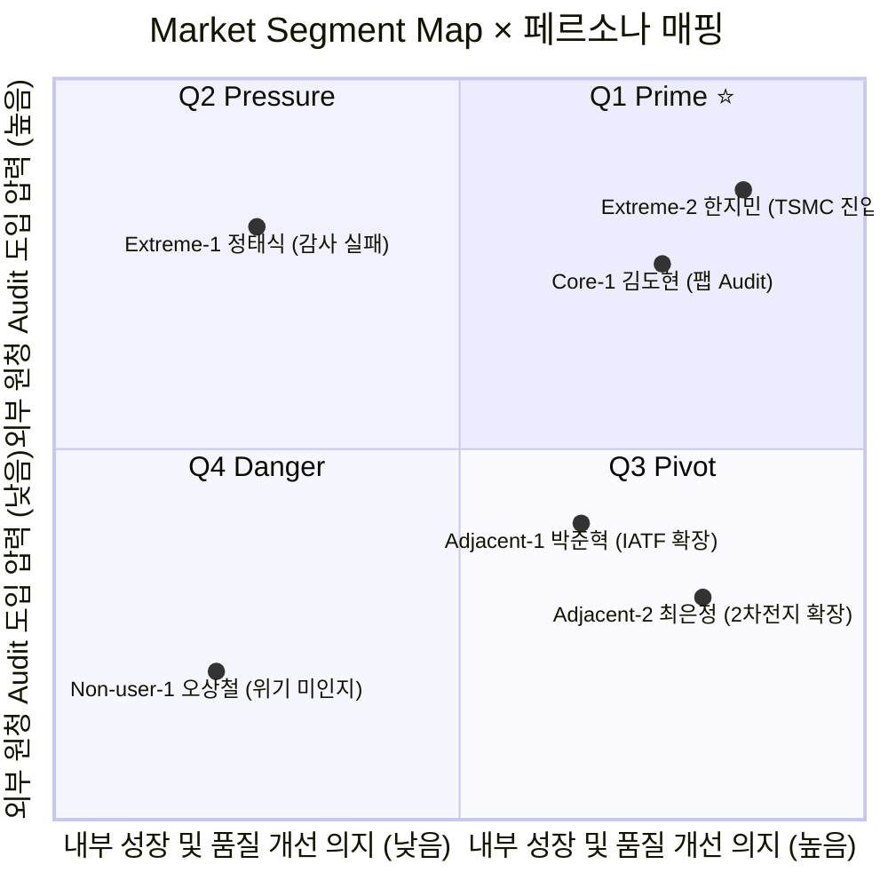
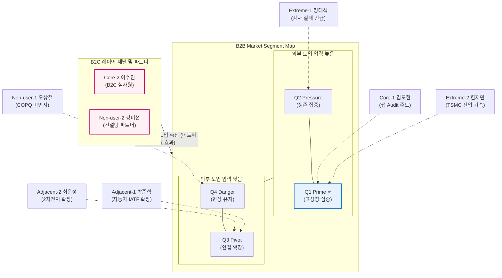

# 🎯 반도체 소부장 경영혁신 AI+LEAN+ISO SaaS: TAM-SAM-SOM 및 Market Segment 통합 리포트

본 문서는 반도체 소부장(소재·부품·장비) SME를 타겟으로 하는 **AI+LEAN+ISO 통합 SaaS 사업**의 기초 시장 규모(TAM-SAM-SOM) 산출 근거와, 이를 효과적으로 공략하기 위한 고객 페르소나 기반의 시장 세분화(Market Segment Map) 전략을 통합한 종합 리포트입니다.

---

## 📊 1. TAM–SAM–SOM 시장 규모 산출표

| 구분 | 전략 단계 | 시장 정의 | 시장 규모 및 기대 매출 | 핵심 산출 근거 |
|:---:|---|---|---|---|
| **TAM**<br>(전체 시장) | 1단계 (광범위 탐색) | 글로벌 반도체 소부장 산업에서 AI+LEAN+ISO 통합 운영혁신이 해결할 수 있는 **전체 잠재적 가치풀**. | **글로벌**: $300–500M (2024)<br>**국내 누적(5년)**: 1,750억원<br>**Pain Cost 가치풀**: 국내 7–17조원 | 반도체 소부장 시장 $200–220B 중 연간 $50–130B가 불량·기회비용으로 소실됨. CHIPS Act 등 정부 보조금 동인이 구조적 쐐기로 작용. 월 $500~$5,000 수준의 중소기업 통합 솔루션은 전무함. |
| **SAM**<br>(유효 시장) | 2단계 (범위 축소) | 글로벌 반도체 소부장 **50–500인 SME** 중 SaaS 도입 자격(디지털 성숙도, 예산 등)을 갖춘 대상. | **글로벌**: $65M (중립)<br>**국내**: 30억원 (중립)<br>**Q1 Prime Zone**: 6–15억원 | 4단계 필터(디지털 55% → ISO 70% → 예산 75% → 미잠금 85%) 적용. TAM 대비 SAM 비율 13–22% (SaaS 초기 시장 벤치마크 10–25%와 일치). Top-Down과 Bottom-Up이 놀랍게 수렴함. |
| **SOM**<br>(초기 획득 시장) | 7단계 (초기 획득) | 플랫폼 출시 **1년 차(MVP)** 확보 가능한 실제 유료 고객사(B2B + B2C) 매출. 진단+구독 하이브리드 모델. | **국내 1년 차 실수금**: **3.50억원**<br>**연말 ARR**: 5.14억원 | 진단 100건 + 구독 268명(B2B+B2C). 해외 팹 직납이력 보유 20~25개사를 최우선 타겟. 혁신바우처 등 보조금 85% 연계를 통해 실 고객 부담금 월 12만 원으로 허들 최소화. |

---

## 🗺️ 2. Market Segment Map × 페르소나 통합 매핑

> **축 정의**
> - **X축**: 내부 구매여력 및 성장 의지 — 생존 중심 (Survival, 낮음) ↔ 고성장 중심 (Growth, 높음)
> - **Y축**: 외부 도입 압력 — 낮음 ↔ 높음 (원청 팹 Audit 요구, 품질 디지털화 압력 증가 등)

### 2-1. Market Segment 2x2 상세 매트릭스

| 축 정의 | 내부 성장 및 품질 개선 의지 (낮음) | 내부 성장 및 품질 개선 의지 (높음) |
|---|---|---|
| **외부 도입 압력 (높음)** | **[Q2] Pressure Zone (밀려서 검토)**<br>👉 **Extreme-1 정태식 (감사 실패)** | **[Q1] Prime Zone ⭐ (핵심타겟)**<br>👉 **Core-1 김도현 (팹 Audit) / Extreme-2 한지민 (TSMC 진입)** |
| | - **특징**: 삼성 등 원청 압박은 거세나, OPM이 낮고 생존에 급급해 자력 도입이 어려운 60~80개사.<br>- **맥락**: "필요한 건 아는데 돈이 없다."<br>- **전략**: **보조금 100% 매핑 + 긴급 감사 통과 패키지**로 방어망을 해제. | - **특징**: 고성장 중이며, 해외 고객사(TSMC 등)의 Audit 통과가 시급한 40~60개사. (OPM 15%+)<br>- **맥락**: "안 사면 성장을 못 따라간다."<br>- **전략**: 도입의향 70~80%의 최우선 타겟 가치 제안. |
| **외부 도입 압력 (낮음)** | **[Q4] Danger Zone (버티기 모드)**<br>👉 **Non-user-1 오상철 (위기 미인지)** | **[Q3] Pivot Zone (전환 준비 구간)**<br>👉 **Adjacent-1 박준혁(위기) / Adjacent-2 최은정(2차전지)** |
| | - **특징**: 정체 시장, 전통 하청 부품사. 중국 재위협 등 위험에 둔감한 160~200개사.<br>- **맥락**: "지금은 혁신보다 현상 유지가 우선이다."<br>- **전략**: 직접 영업 제외. 스마트공장 **정책 채널을 통한 Nurturing 유도**. | - **특징**: 기존 시장은 안정되나, 신공정/타산업(전장, 2차전지) 확장 시도를 하는 80~100개사.<br>- **맥락**: "기존 방식으로는 다음 고객을 뺏을 수 없다."<br>- **전략**: Q1 레퍼런스 확립 후 인접 **확장 타겟(TAM 확대)**. |

### 2-2. 사분면 차트 (Quadrant Chart)



### 2-3. Market Segment & B2C 레이어 관계도 (Flowchart)



### 2-4. 공략 최적화 로드맵

```
  [0~6개월]                    [6~18개월]                   [12~24개월]                 [2~5년]
  Q1 Prime ⭐      ────→       Q3 Pivot         ────→       Q2 Pressure     ────→       Q4 Danger
  성장우선, 팹 납품             인접 확장(전장 등)             감사 탈락 위험              버티기 모드
  (가장 수익성 높음)            (레퍼런스 확장)                (보조금 활용)               (장기 육성)
```

---

## 🔎 3. 백그라운드 지식 검증 리포트

### 3-1. 5대 핵심 가설 및 검증 상태

| 가설 | 핵심 진술 | 지지 데이터 | 검증 상태 |
|---|---|---|---|
| **H1 (진입점)** | 팹(원청)의 품질 요건 강화가 "거래 상실 공포"라는 도입 트리거. | TSMC ISO 9001/탄소 의무화, 삼성 AI 품질 압박. | ●●●○○ 중간 |
| **H2 (타겟세분화)** | 해외 팹 직납, 매출 200~1,000억의 SME가 조기수용자(Early Adopter). | 스마트공장 도입률: 중기업 54% vs 소기업 28%. | ●●○○○ 약함 |
| **H3 (가격모델)** | 혁신바우처 등 보조금 적용 시 체감 가격은 월 10만 원대로 수렴. | 정부 AX 예산 83.6% 인상, 보조금 최대 85%. | **●●●●○ 강함** |
| **H4 (MVP번들)** | [ISO 문서 자동 생태계] + [AI SPC 이상 감지]가 핵심 연계. | InfinityQS 불량비용 절감 선례. | ●●●○○ 중간 |
| **H5 (GTM채널)** | 정부 '스마트공장 공급기업' 등록 및 ISO 파트너사가 GTM 확산 채널. | 도입 SME의 89.2%가 정부 지원으로 도입. | ●●●○○ 중간 |

### 3-2. 핵심 발견 인사이트 (Key Findings)

1.  **동력의 특수성**: 이 시장의 도입 트리거는 자발적 혁신이 아니라 **'원청 팹의 하향식 감사 압박(Push)' + '정부 보조금 예산(Pull)'**이라는 두 외부 쐐기가 교차할 때 터진다.
2.  **포지셔닝의 재설정**: 단순한 'ISO 대행 절감' 툴이 아니다. ISO 유지비 자체가 저렴하기 때문이다. 핵심은 경영진 관점의 **"감사 전 2주간의 인력 소모 단축 + AI를 통한 상시 불량 기회비용 단속"**이라는 점이다.
3.  **카테고리 생성 주도**: 자동차 OEM들이 IATF를 강제해 시장을 폭발시킨 것처럼, 반도체 대기업 실사단의 강화된 요구는 피할 수 없는 'Category Creation Event'로 확정된다.

---

## 🧩 4. 5-Whys 기반 문제의식 및 솔루션 루프

| 계층 (Why) | 문제의식 | 근본 원인 | 돌파구 (전략 함의) |
|---|---|---|---|
| **Why-1 (현상)** | SME가 AI, 린, ISO 혁신에 모두 실패한다. | 80%가 비용과 인력 부족으로 "불필요" 합리화. | 장벽 자체를 부수는 게 아니라 우회로(보조금, 번들링)를 제공해야 함. |
| **Why-2 (공급)** | 왜 장벽을 깨는 솔루션이 시장에 없나? | 월 $500~$5,000대의 SMB 최적화 통합 SaaS가 전무 (미싱 미들). | 중가형 통합 패키지를 독점 출시하면 퍼플 오션 획득 가능. |
| **Why-3 (기술)** | 왜 벤더들은 이 솔루션을 안 만들었나? | 반도체+ISO+AI+OT 5대 복합 도메인 지식의 진입장벽 극상. | 우리의 5대 교차 전문성이 곧 카피할 수 없는 진입장벽임. |
| **Why-4 (시장)** | 왜 시장은 자생적으로 크지 못했나? | 대형 팹들이 '결과(수율)'만 볼 뿐, 하청의 '과정(도구)'을 지도하지 않음. | 팹의 디지털 증빙 강화 트렌드를 영업 스토리의 핵심 연료로 활용. |
| **Why-5 (구조)** | 왜 정부마저 공백을 닫지 못했는가? | HW 하드웨어 고도화 중심, 부처 간 사업 칸막이(분절 지원). | **외부 쐐기(적합 가격의 All-in-One SaaS + 보조금 매핑)**로 악순환을 파괴. |

### 🔄 솔루션 선순환 루프 확립
`월 $500대 ISO/SPC 통합본 도입 (보조금 매핑)` ➡ `90일 내 ROI 가시화 (감사 시간 절반 단축)` ➡ `레퍼런스(Q1 Prime) 기반 팹 납품사 간 바이럴` ➡ `SaaS 생태계 락인 완료`

---

## 📎 부록: 지표 건전성 벤치마크

| 검증 지표 | 본 사업 예상 수치 | 벤치마크 (정상 범주) | 건강도 |
|---|---|---|---|
| **SAM / TAM 비율** | 13 ~ 22% | SaaS 초기 B2B 시장 특성상 10~25% | **✅ 매우 정상** |
| **SOM / SAM 달성률 (Y1)** | 약 12% | B2B 스타트업 1년 차 목표 5~15% | **✅ 현실적** |
| **LTV : CAC 비율** | 9.1 : 1 (Business 기준) | 건전성 기본 기준 3:1 이상 | **✅ 뛰어난 수익성** |
| **ARPU 편차 구조** | B2B가 B2C 대비 6.6배 | 프리미엄/스타터 티어 격차 | **✅ B2B 주도 전략 부합** |
