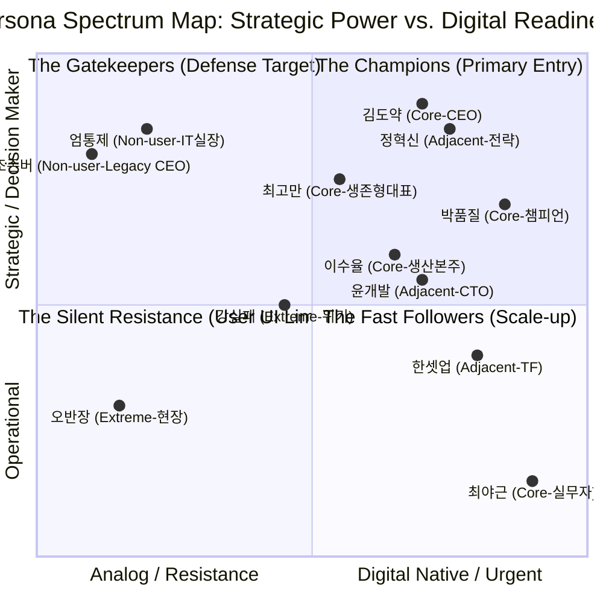
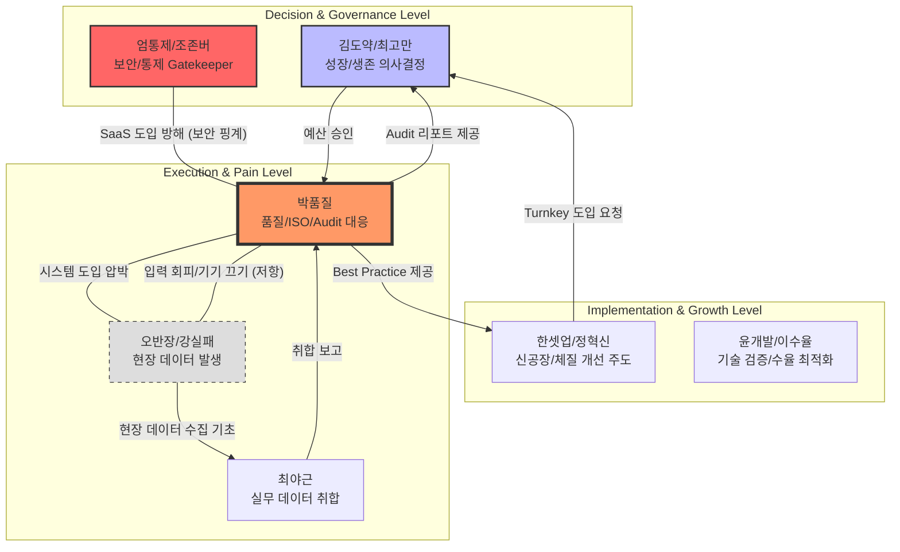

# Final Persona Spectrum Map (Strategic Ecosystem)

본 문서는 반도체 소부장 SME 시장 진입을 위한 최종 **'페르소나 스펙트럼 및 관계 구조화'**를 완료한 결과물입니다.

---

## 📊 1. Persona Strategic Quadrant (성숙도 vs 영향력)

12종의 초기 페르소나와 4종의 핵심 페르소나를 조직 내 **전략적 영향력(Power)**과 **디지털 전환 수용도(Readiness)**를 기준으로 매핑한 스펙트럼입니다.

---

## 🔗 2. Persona Relationship Dynamics (조직 내 역학 구조)

페르소나 간의 갈등(Conflict), 시너지(Synergy), 데이터 흐름(Data Flow)을 구조화하여 영업 및 도입 시나리오를 설계합니다.

---

## 💡 3. 페르소나 간 3대 핵심 관계 분석

### 1) [Conflict] 챔피언 (박품질) vs 게이트키퍼 (엄통제)
*   **관계 양상**: 박품질은 Audit 대응을 위해 SaaS가 절실하나, 엄통제는 '보안 리스크'를 명분으로 자신의 통제권 약화를 우려해 방해함.
*   **전략적 해법**: 도입을 'IT 부서의 실패'가 아닌 **"전산실 주도의 안전한 클라우드 전환 성과"**로 포장할 수 있는 보안 가시성(ISO 27001)과 망분리 지원 기능을 제공함.

### 2) [Operational Friction] 챔피언 (박품질) vs 현장 작업자 (오반장)
*   **관계 양상**: 박품질은 정밀한 데이터를 원하지만, 오반장은 조작 자체를 업무 방해로 여김. 여기서 **'히든 팩토리(Hidden Factory)'** 비용이 발생함.
*   **전략적 해법**: **Zero-UI(음성입력, AI 비전 인식)**를 통해 오반장의 조작 허들을 제거하여, 박품질에게 "싸우지 않고 얻는 실시간 데이터"를 제공함.

### 3) [Expansion Synergy] 챔피언 (박품질) ↔ 스케일업 파트너 (한셋업)
*   **관계 양상**: 단일 공장의 박품질이 성공 사례를 만들면, 2공장을 짓는 한셋업은 백지상태에서 이 시스템을 **'턴키(Turn-key)'**로 복제하기를 원함.
*   **전략적 해법**: 신공장 증설이라는 **트리거 이벤트(Trigger Event)**에 맞춰 "1주 만에 구축하는 글로벌 스탠다드 체계"라는 템플릿(SaaS)을 공급함.

---

## 🎯 4. 페르소나별 시장 진입 쐐기 (Entry Wedge) 전략 요약

| 페르소나 (Segment) | 핵심 진입 논리 (Wedge) | 기대 효과 (Value) |
| :--- | :--- | :--- |
| **박품질 (Core)** | "문서 지옥에서 구출해 드립니다." | 수기 타이핑 80% 감소, Audit 무결점 |
| **한셋업 (Adjacent)** | "신공장 체계, 1주일 만에 턴키로 끝내세요." | 시스템 구축 기간 70% 단축 |
| **오반장 (Extreme)** | "아무것도 누르지 마세요. 말만 하면 됩니다." | 현장 저항 제로, 데이터 정합성 확보 |
| **엄통제 (Non-user)** | "귀사의 보안망을 건들지 않는 프라이빗 SaaS." | IT 통제권 사수 및 클라우드 도입 성과 |

---

> [!IMPORTANT]
> **결론**: 본 스펙트럼 맵의 완성은 **"누가 이 제품을 왜 사야 하는가"**에 대한 답변을 넘어, **"조직 내에서 이 제품이 어떻게 번져나가고 누구를 설득해야 최종 승인이 나는가"**에 대한 입체적인 공격 지도를 완성했음을 의미합니다.
