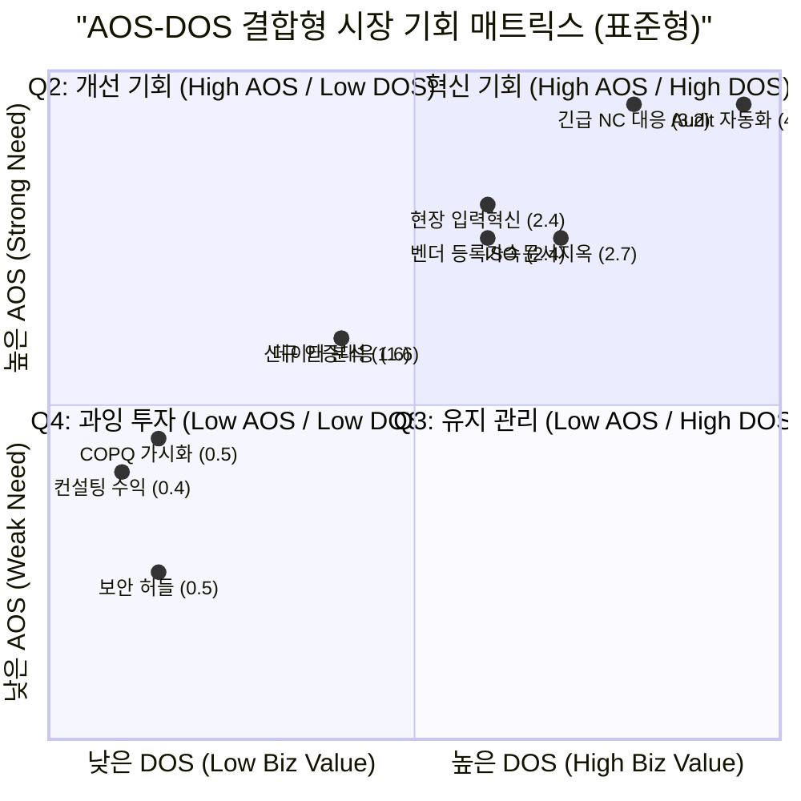

# AOS-DOS 결합형 Matrix (최종 비즈니스 기회 맵)

본 문서는 **AOS(고객 니즈 강도)**와 **DOS(시장 사업적 가치)**를 평면적으로 결합하여, 단순한 고충 해결을 넘어 **"지속 가능한 비즈니스 모델"** 관점에서의 시장 진입 우선순위를 확정한 최종 리포트입니다.

---

## 📊 AOS-DOS 통합 매트릭스 (Combined Matrix)

**X축: DOS (시장 가치)** | **Y축: AOS (니즈 강도)** | **버블 크기: DOS**

---

## 📑 AOS-DOS 전략 매핑 테이블

**"AOS 단일 평가를 넘어선"** 최종 비즈니스 전략 매핑 결과입니다.

| Pain/Goal | AOS (Need) | DOS (Market) | Quadrant | 페르소나 | 최종 전략 (Action) |
| :--- | :---: | :---: | :---: | :---: | :--- |
| **Audit 대응 자동화** | 4.0 | **4.0** | **Q1** | 김도현, 박품질 | 🔥 **타겟팅 1순위 (MVP 코어)** |
| **긴급 NC 시정 조치** | 4.0 | **3.2** | **Q1** | 정태식, 강실패 | ⚡ **긴급 구조 패키지 (Entry Wedge)** |
| **ISO 문서 관리 지옥** | 3.0 | **2.7** | **Q1** | 한셋업, 박품질 | 📂 **Admin Zero 스탠다드화** |
| **해외 벤더 등록 가속** | 3.0 | **2.4** | **Q1** | 한지민, 김도약 | 💰 **수익성 높은 선별 타겟팅** |
| **현장 데이터 입력 혁신** | 3.2 | **2.4** | **Q1** | 오반장, 이수율 | 📱 **사용자 점유 및 해자(Moat) 구축** |
| **신규 인증 대응(IATF)** | 2.4 | **1.6** | **Q4** | 박준혁, 최은정 | ⏳ **인접 시장 확장을 위한 관망** |
| **공정 데이터 분석지연** | 2.4 | **1.6** | **Q4** | 이수율, 최은정 | 🧪 **데이터 모듈화 후 단계적 제공** |
| **COPQ 정량화 부재** | 1.8 | **0.5** | **Q4** | 오상철, 김도현 | 📉 **무료 진단/마케팅용 활용** |
| **보안 통제 및 불신** | 1.0 | **0.5** | **Q4** | 엄통제, 조존버 | 🛡️ **도입 전 필수 체크리스트화** |
| **컨설팅 차별성 부재** | 1.6 | **0.4** | **Q4** | 이수진, 강미선 | 🤝 **파트너 채널 장기 관계 유지** |

---

## 🧠 전략적 결산 (Executive Summary)

1.  **High AOS / High DOS (Q1)**: '감사 대응'과 'NC 시정'은 고객의 절박함과 시장 파급력이 동시에 수렴하는 지점입니다. 우리 사업의 **SOM(1년 내 목표 매출 3.5억)**은 100% 이 영역에서 나옵니다.
2.  **Low AOS / Low DOS (Q4)**: 'COPQ 가시화'나 '신규 인증'은 분명 가치가 있으나, 현재 우리의 인적/물적 자원을 집중하기에는 **AOS 필터(절박함)**가 낮습니다. 이는 본 사업의 스케일업 단계(Y3 이후)로 미룹니다.
3.  **결론**: AOS가 높은 항목들 중에서도 **DOS 점수가 2.5 이상인 항목들**에 대해 **"우선순위 1위 타겟팅"**을 확정하여 개발 및 마케팅 자원을 집중 투입합니다.

---

> [!IMPORTANT]
> **핵심 원칙**: "AOS는 우리의 문을 열어주고(Entry), DOS는 우리의 금고를 채워준다(Sustainability)."
