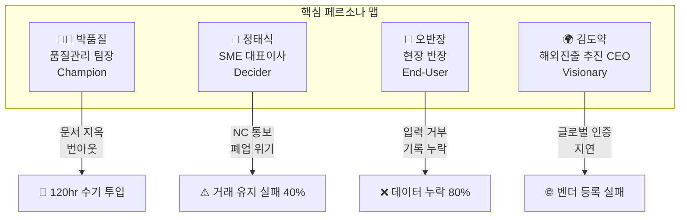
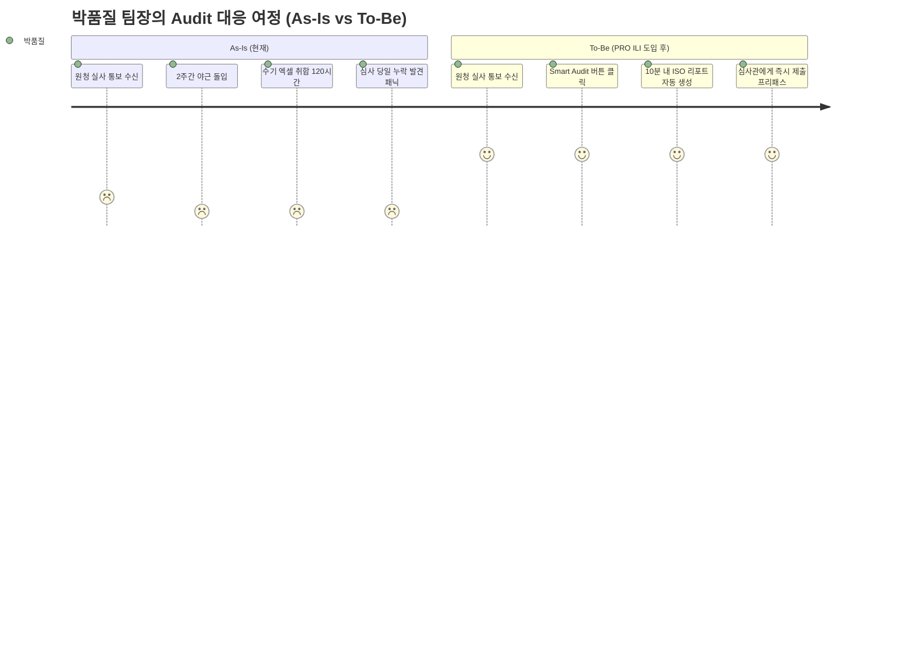
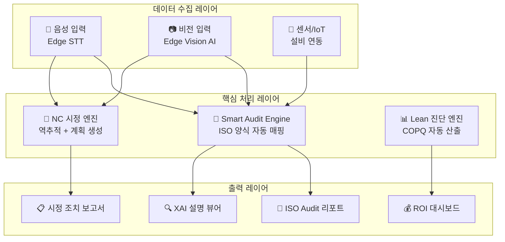
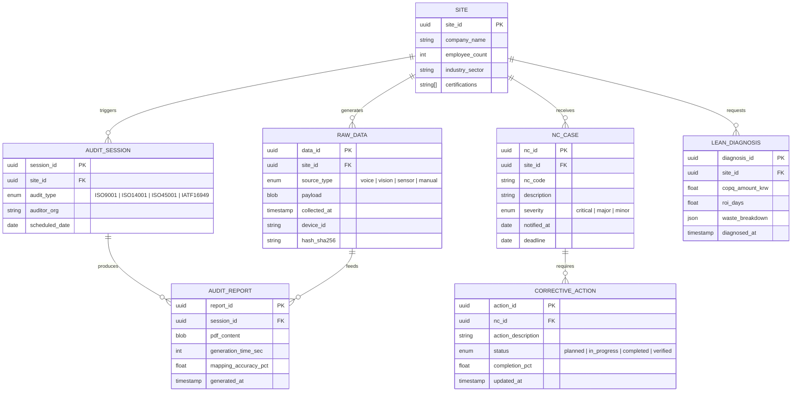
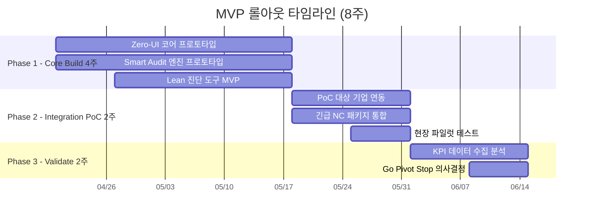

# PRO ILI SMART — 제품 요구사항 문서 (PRD) v0.1

- **Owner 팀:** PRO ILI Product & Engineering
- **최종 업데이트:** 2026-04-13
- **원본 VPS:** [06_Value-proposition-sheet_260410(final).md](../04_VPS-Final/06_Value-proposition-sheet_260410(final).md)

---

## 1. 개요·목표

### 1.1 문제 정의 (Pain 지표 포함)

반도체 소부장 SME(50~500인)는 ISO 인증 심사(Audit) 대응에 매번 **120시간 이상의 수기 문서 작업**을 투입하며, 현장 데이터 입력 거부율이 **80% 이상**에 달해 '가짜 혁신'에 갇혀 있다. 이로 인한 영업이익 잠식률은 **20~30%** (연간 7~17조 원 규모)이다.

| Pain 항목 | 실패 KPI (현재 기준선) | 임계 수준 |
| :--- | :--- | :--- |
| **문서 지옥 (수기 Audit 대응)** | 1회 감사당 수기 투입 시간 = **120시간** | 품질팀 번아웃 지수 ≥ 4.0/5.0 |
| **원청 탈락 위기 (NC 통보)** | NC 통보 후 거래 유지 실패율 = **40%** | 재계약 실패 시 매출 감소 ≥ 30% |
| **현장 입력 저항** | 데이터 누락/거부율 = **80%** | 데이터 정합성 ≤ 20% |
| **히든 팩토리 비용** | 불량·대기 등 COPQ가 영업이익의 **20~30%** 잠식 | 연간 손실 7~17조 원 |
| **IT 도입 거부감** | SME 중 80%가 비용/인력 부족으로 디지털 전환 포기 | 전환율 ≤ 20% |

### 1.2 목표 (Desired Outcome 수치화)

> **"현장의 Raw-Data를 수집하여 10분 내에 ISO 오딧 증빙 리포트를 뽑아내는 핵심 파이프라인을 구축한다."**

| 목표 항목 | 현재 (As-Is) | 목표 (To-Be) | 단축/개선 폭 |
| :--- | :---: | :---: | :---: |
| Audit 리포트 생성 시간 | 120시간 | **≤ 10분** | **99.86% 단축** |
| 현장 데이터 정합성 | 20% | **≥ 95%** | 4.75× 향상 |
| 시범 사업장 ROI 증명 기한 | 미측정 | **30일 이내** | 1개월 내 가치 증명 |
| Audit 결과 프리패스율 | ~60% | **≥ 90%** | 1.50× 향상 |

### 1.3 성공 지표 (북극성 / 보조 KPI)

| 구분 | KPI | 기준선 (Baseline) | 목표값 (Target) | 측정 주기 |
| :---: | :--- | :---: | :---: | :---: |
| ⭐ **북극성** | **Audit 리포트 생성 소요 시간** | 120시간 | ≤ 10분 | Sprint 단위 (2주) |
| 보조 ① | 현장 데이터 수집 정합성 (Zero-UI 경유) | 20% | ≥ 95% | 주간 |
| 보조 ② | NC 통보 후 90일 시정 완료율 | 추정 30% | ≥ 85% | 월간 |
| 보조 ③ | Lean 진단 후 30일 내 COPQ 절감 증명률 | 0% (미측정) | ≥ 70% | PoC 종료 시 |
| 보조 ④ | LTV:CAC 비율 | N/A (신규) | ≥ 9:1 | 분기 |
| 보조 ⑤ | 파일럿 고객 NPS (Net Promoter Score) | N/A | ≥ 60 | 분기 |

---

## 2. 사용자와 페르소나

### 2.1 핵심 페르소나 요약

### 2.2 페르소나별 여정 Pain·Needs 링크

| 페르소나 | 핵심 상황 (Situation) | 핵심 고통 (Pain) | 핵심 니즈 (Needs) |
| :--- | :--- | :--- | :--- |
| **박품질** (팀장) | 원청 실사관 현장 도착 | 2주 야근, 전사 라인 중단 | 10분 내 완벽한 디지털 증빙 제시 |
| **정태식** (CEO) | NC 통보로 계약 파기 위기 | 매출 30%+ 감소, 폐업 위기 | 90일 내 신뢰 회복 증빙 생성 |
| **오반장** (현장) | 장갑·기름 투성이 작업 중 | 기록 누락/거부, 품질 사고 | 마찰 없는 사진/음성 기록 |
| **김도약** (CEO) | TSMC 등 해외 팹 견적 제출 | 글로벌 스탠다드 미충족 | 국제 인증 체계 증명 |

---

## 3. 사용자 스토리와 수용 기준 (AC)

### Story 3.1 — Smart Audit 자동 리포트 생성

> **As a** 품질관리팀장(박품질),
> **I want** 현장 Raw-Data가 ISO 규격 양식으로 10분 내 자동 매핑되도록,
> **so that** 원청 실사 시 완벽한 디지털 증빙을 즉시 제출하고 야근을 90% 이상 줄일 수 있다.

| AC # | Given (전제) | When (행동) | Then (결과 — 측정 임계치) |
| :---: | :--- | :--- | :--- |
| AC-1 | 현장 센서/Zero-UI로 수집된 데이터 ≥ 50건이 시스템에 적재되어 있을 때 | "Audit 리포트 생성" 버튼을 클릭하면 | **ISO 9001** 양식 리포트가 **≤ 10분** 내에 PDF로 생성된다 _(ISO 14001/45001은 Sprint 2 확장)_. 생성 실패율 **< 0.5%** |
| AC-2 | 리포트가 생성 완료되었을 때 | 원청 심사관이 리포트를 검증하면 | 필수 항목 누락률 **= 0%**, 데이터-원본 매핑 정확도 **≥ 99%** |
| AC-3 | 과거 3개월간 축적 데이터가 존재할 때 | 트렌드 분석 섹션을 요청하면 | 주요 품질 지표 트렌드 차트가 리포트에 포함되고, 이상 징후 탐지 정밀도 **≥ 90%** |
| AC-4 | 복수 원청(삼성·SK 등)의 양식 템플릿이 등록되었을 때 | 특정 원청 양식을 선택하면 | 해당 원청 커스텀 양식으로 리포트가 자동 변환된다. 양식 매핑 오류율 **< 1%** |

### Story 3.2 — 긴급 NC 시정 조치 (위기 회복)

> **As a** SME 대표이사(정태식),
> **I want** NC(부적합) 통보 즉시 시정 조치 증빙을 생성할 수 있도록,
> **so that** 90일 내 원청 신뢰를 회복하고 거래 유지율을 높인다.

| AC # | Given (전제) | When (행동) | Then (결과 — 측정 임계치) |
| :---: | :--- | :--- | :--- |
| AC-1 | NC 통보 사유가 시스템에 입력되었을 때 | "긴급 시정 조치 플랜 생성"을 요청하면 | 시정 조치 계획서 초안이 **≤ 5분** 내에 생성된다. 필수 시정 항목 커버리지 **≥ 95%** |
| AC-2 | 시정 조치가 진행 중일 때 | 진행률 대시보드를 확인하면 | 전체 시정 항목의 완료율이 실시간(지연 **≤ 30초**)으로 갱신된다 |
| AC-3 | 시정 완료 데이터가 축적되었을 때 | 원청 제출용 종합 보고서를 생성하면 | 시정 전·후 비교 데이터가 시각화되며, 데이터 무결성 타임스탬프와 해시값이 **100%** 기록된다 |

### Story 3.3 — Zero-UI 현장 데이터 수집

> **As a** 현장 반장(오반장),
> **I want** 장갑을 벗지 않고도 사진/음성으로 품질 기록을 남길 수 있도록,
> **so that** 데이터 누락을 95% 이상 방어하고 생산 흐름을 끊지 않는다.

| AC # | Given (전제) | When (행동) | Then (결과 — 측정 임계치) |
| :---: | :--- | :--- | :--- |
| AC-1 | 현장에서 작업 중(80dB+ 소음 환경)일 때 | 음성 명령으로 "불량 기록"을 말하면 | 음성 인식 정확도 **≥ 92%**, 기록 완료까지 **≤ 3초** (Edge 처리) |
| AC-2 | 부품/제품 이미지를 촬영할 때 | 카메라로 대상을 비추면 | 비전 AI가 부품 ID·상태를 자동 인식. 인식 정확도 **≥ 90%**, 처리 시간 **≤ 2초** |
| AC-3 | 네트워크 불안정(오프라인) 환경일 때 | 데이터를 입력하면 | Edge 디바이스에 로컬 저장 후, 네트워크 복구 시 **5분 내** 자동 동기화. 데이터 유실율 **= 0%** |

### Story 3.4 — 글로벌 벤더 등록 가속 _(Could — Phase 2 구현 예정)_

> **As a** 해외 진출 CEO(김도약),
> **I want** TSMC·인텔 등 글로벌 팹의 벤더 등록 요구사항을 자동 체크리스트로 생성할 수 있도록,
> **so that** 벤더 등록 성공률을 30% 이상 높이고 수주 기회를 확대한다.

| AC # | Given (전제) | When (행동) | Then (결과 — 측정 임계치) |
| :---: | :--- | :--- | :--- |
| AC-1 | 대상 팹(예: TSMC)을 선택했을 때 | "벤더 등록 체크리스트 생성"을 실행하면 | 해당 팹 요구 인증·문서 항목이 **≤ 30초** 내 자동 매핑된다. 항목 누락률 **< 3%** |
| AC-2 | 체크리스트 항목별 현재 준비 상태가 입력되었을 때 | Gap 분석 리포트를 요청하면 | 미충족 항목·예상 소요 기간·우선순위가 자동 산출. 리포트 생성 **≤ 60초** |
| AC-3 | Gap이 해소된 후 | 종합 벤더 등록 패키지를 다운로드하면 | 글로벌 표준(IATF 16949, ISO 9001 등) 적합 증빙이 포함된 패키지가 생성된다. 포맷 오류 **= 0건** |

### Story 3.5 — Lean 진단 COPQ 가시화

> **As a** SME 대표이사(정태식),
> **I want** 공장의 숨겨진 낭비(COPQ)를 자동 진단하여 실시간 대시보드로 확인할 수 있도록,
> **so that** 30일 내에 현금 절감을 증명하고 사업 투자의 즉시 회수를 실현한다.

| AC # | Given (전제) | When (행동) | Then (결과 — 측정 임계치) |
| :---: | :--- | :--- | :--- |
| AC-1 | 최소 7일 이상의 생산 데이터가 시스템에 축적 | "COPQ 진단" 실행 | 낭비 유형별(불량·대기·재작업·과잉생산) 금액 시각화 **≤ 30초**. 산출 정확도 **≥ 85%** |
| AC-2 | COPQ 진단 완료 후 30일 경과 | "ROI 리포트" 요청 | 진단 전·후 COPQ 절감 비교 자동 산출. 절감 기간·금액·ROI 양수 달성 일수 표시 |
| AC-3 | CEO가 대시보드 확인 | 경영진 요약 리포트 다운로드 | 월간 절감 추이 + 누적 ROI 그래프 포함 PDF. 생성 **≤ 60초** |
| **AC-4** | _(실패 케이스)_ | | |
| AC-4a | 생산 데이터 **7일 미만** 축적 | "COPQ 진단" 실행 | "최소 7일 데이터 필요 (현재: N일)" 오류 표시 **≤ 2초**. 진단 차단 |
| AC-4b | 진단 결과 COPQ 절감이 **통계적으로 유의미하지 않음** (절감 < 100만원/월) | 대시보드 표시 | "⚠️ 유의미성 부족 — 추가 데이터 수집 권장" 경고 배너. 최소 3주 추가 데이터 축적 가이드 |
| AC-4c | 생산 데이터에 **이상치 ≥ 30%** 포함 | 진단 실행 | "데이터 품질 경고 — 이상치 N% 감지" 알림. 이상치 제외/포함 옵션 제공. 재산출 **≤ 15초** |
| **AC-5** | _(감사 추적성)_ | | |
| AC-5a | COPQ 진단 파라미터 **변경** (기준 기간·산출 방식 등) | 저장 클릭 | 변경 전·후 값, 변경자 ID, 시각을 `AUDIT_LOG` 불변 기록 |
| AC-5b | ROI 리포트 **외부 제출** (다운로드) | 다운로드 클릭 | **SHA-256 해시 + 타임스탬프** 자동 부착. `LEAN_SUBMISSION_LOG` 기록 |

### 사용자 스토리 여정 다이어그램

---

## 4. 기능 요구사항 (Functional)

### 4.1 MoSCoW 우선순위 매트릭스

| 우선순위 | 기능명 | 설명 | 연결 JTBD / Story | 대안 대비 차별 근거 | 1스프린트 구현 가능성 |
| :---: | :--- | :--- | :---: | :--- | :--- |
| **Must** | **Smart Audit 엔진** | Raw-Data → ISO 양식 자동 매핑, 10분 내 리포트 생성 | Story 3.1, JTBD #1 | 기존: 수기 120시간 → 자동 10분 (720× 단축) | ✅ ISO 9001 코어 10MD (WBS 참조) |
| **Must** | **긴급 NC 시정 패키지** | NC 통보 즉시 시정 조치 계획·증빙 자동 생성 | Story 3.2, JTBD #2 | 기존: 수동 대응 → 5분 내 초안 (Entry Wedge) | ✅ NC 코어 8MD (Sprint 1 W2) |
| **Must** | **Zero-UI 수집기** | Edge AI 비전/음성으로 마찰 없는 현장 데이터 수집 | Story 3.3, JTBD #3 | 기존: 키보드 입력 (거부율 80%) → 음성/비전 (거부율 <5%) | ✅ STT 코어 10MD (WBS 참조) |
| **Must** | **Lean 진단 도구 (COPQ Dashboard)** | 낭비 절감액 실시간 가시화, 30일 내 ROI 증명 | Story 3.5, 가치 증명 | 기존: 컨설팅 3개월 후 보고 → 30일 자동 산출 | ✅ COPQ 코어 8MD (WBS 참조) |
| **Should** | **XAI 신호등 뷰어** | 데이터 무결성 보증용 설명 가능 AI, 타임스탬프 아카이빙 | 신뢰 확보 | 기존: 블랙박스 AI → 의사결정 근거 투명 공개 | ⚠️ 2스프린트 — SHAP/LIME + UI → Phase 2 |
| **Could** | **글로벌 벤더 등록 가속기** | TSMC/인텔 등 팹별 체크리스트 자동 생성·Gap 분석 | Story 3.4, JTBD #4 | 기존: 수동 조사 → 자동 매핑 (수주율 30%↑) | ⚠️ 2스프린트 — 팹 DB 선행 → Phase 2 |
| **Could** | **보조금 매핑 도우미** | 중소기업 혁신바우처 등 정책 자금 자동 매칭 | 도입 허들 제거 | 85% 정부 보조 자동 연결 → 체감가 월 12만원 | ✅ 1스프린트 — 정부 API 연동 5MD |
| **Won't (v1)** | **공급망 리스크 예측** | 원자재·협력사 리스크 사전 경고 | 확장 | Phase 2 이후 | — |

### 4.2 핵심 기능 아키텍처 개요

---

## 5. 비기능 요구사항 (NFR)

### 5.1 성능

| 항목 | 지표 | 목표 |
| :--- | :--- | :--- |
| Audit 리포트 생성 (p95) | 응답 시간 | **≤ 600초 (10분)** |
| Zero-UI 음성 인식 (p95) | 응답 시간 | **≤ 3초** (Edge 처리) |
| Zero-UI 비전 인식 (p95) | 응답 시간 | **≤ 2초** (Edge 처리) |
| NC 시정 계획 생성 (p95) | 응답 시간 | **≤ 300초** |
| 대시보드 실시간 갱신 | 지연 시간 | **≤ 30초** |
| 동시 접속 지원 | 사용자 수 | **≥ 50명** (사업장 단위) |

### 5.2 신뢰성

| 항목 | 지표 | 목표 |
| :--- | :--- | :--- |
| 서비스 월 가용성 | Uptime | **≥ 99.5%** |
| Audit 리포트 생성 오류율 | 실패율 | **< 0.5%** |
| 데이터 유실율 (Edge→Cloud 동기화) | 유실율 | **= 0%** |
| 데이터 무결성 (타임스탬프/해시) | 위변조 탐지율 | **= 100%** |

### 5.3 보안·컴플라이언스

| 항목 | 요구사항 |
| :--- | :--- |
| 데이터 암호화 | AES-256 (저장), TLS 1.3 (전송) |
| 접근 제어 | RBAC (역할 기반), MFA 지원 |
| 감사 로그 | 모든 데이터 접근·변경에 대한 불변 감사 로그 유지 |
| 규제 적합성 | ISO 27001 정보보안, 개인정보보호법(PIPA) 준수 |
| 데이터 주권 | 국내 데이터센터 호스팅 (1차), 해외 팹 대응 시 리전 확장 |

### 5.4 비용

| 항목 | 목표 |
| :--- | :--- |
| 고객 체감 월 비용 | **≤ 12만 원** (혁신바우처 85% 적용 후) |
| Edge 디바이스 초기 비용 | **≤ 50만 원/사업장** (클라우드 대비 서버 구축비 0원) |
| 인프라 운영비 (SaaS) | 고객당 월 **≤ $50** (AWS/GCP Tier 기준) |

### 5.5 모니터링 항목

| 구분 | 항목 | 도구/기준 |
| :--- | :--- | :--- |
| **로그** | 애플리케이션 로그, Edge 디바이스 헬스 로그 | ELK Stack / CloudWatch |
| **대시보드** | 북극성 KPI 실시간 트래킹, SLA 어댑티브 보드 | Grafana / Datadog |
| **알림** | 리포트 생성 실패율 > 1%, 가용성 < 99.5%, Edge 오프라인 > 10분 | PagerDuty / Slack Alert |

---

## 6. 데이터·인터페이스 개요

### 6.1 핵심 엔터티 & 주요 필드

### 6.2 외부/내부 API 개요

| API | 방향 | 입력 | 출력 | 제약 |
| :--- | :---: | :--- | :--- | :--- |
| **Audit Report API** | 내부 | `session_id`, `data_filter` | PDF 리포트, 메타데이터 | 생성 시간 ≤ 600초(10분), 페이로드 ≤ 50MB |
| **Zero-UI Edge API** | Edge→Cloud | 음성 WAV / 이미지 JPEG, 디바이스 ID | 인식 결과 JSON (부품ID, 상태, 텍스트) | Edge 로컬 처리 후 동기화, 오프라인 캐시 ≤ 72시간 |
| **NC Response API** | 내부 | `nc_id`, 시정 데이터 | 시정 조치 계획서 PDF, 진행률 JSON | NC 심각도별 SLA: Critical ≤ 24h, Major ≤ 72h |
| **Lean Diagnosis API** | 내부 | `site_id`, 생산 데이터 | COPQ 분석 JSON, ROI 산출 결과 | 최소 7일 데이터 요구, 산출 정확도 ≥ 85% |
| **Template Registry API** | 내부 | 원청명, ISO 표준 코드 | 양식 템플릿 JSON/XML | 원청별 커스텀 템플릿 등록/관리 |
| **혁신바우처 매핑 API** | 외부 | 기업 정보, 사업 유형 | 적합 보조금 목록, 예상 지원금 | 정부 시스템 연동 (중소벤처기업부 API) |

---

## 7. 범위 (In/Out), 리스크·가정·의존성

### 7.1 범위 (Scope)

| 구분 | 항목 |
| :--- | :--- |
| **In-Scope (v0.1 MVP)** | ① Smart Audit 엔진 — ISO 9001 코어 (Sprint 1) → ISO 14001/45001 확장 (Sprint 2), ② Zero-UI 수집기 — 음성 STT 코어 (Sprint 1) → 비전 AI 확장 (Sprint 2), ③ Lean 진단 도구 — COPQ 대시보드 (Sprint 1 W2 착수), ④ 긴급 NC 시정 패키지 (Sprint 1 W2 착수), ⑤ 데이터 무결성 타임스탬프 로그 |
| **Out-of-Scope (v0.1)** | ① 글로벌 벤더 등록 가속기 (Could → Phase 2), ② XAI 신호등 뷰어 (Should → Phase 2), ③ 공급망 리스크 예측 (Won't → Phase 3), ④ 보조금 매핑 도우미 (Could → v0.1 시간 여유 시 검토), ⑤ 다국어 UI (한국어 우선, 영어는 Phase 2) |

### 7.2 리스크

| # | 리스크 | 영향도 | 발생 확률 | 완화 전략 |
| :---: | :--- | :---: | :---: | :--- |
| R-1 | **원청별 Audit 양식 다양성** — 각 원청(삼성·SK·TSMC 등)마다 요구 양식이 상이하여 템플릿 커스텀화 공수 과다 | 높음 | 높음 | 상위 3개 원청 양식 우선 지원 → 템플릿 엔진 범용화 후 점진 확대 |
| R-2 | **현장 소음·광원 열악 환경** — Edge AI 음성/비전 인식 정확도 저하 | 높음 | 중간 | 현장 특화 소음 보정 알고리즘, 저조도 이미지 전처리 모듈 적용. 인식 실패 시 수동 입력 폴백 |
| R-3 | **원청 심사관의 디지털 증빙 거부** — 일부 심사관이 종이 원본만 인정할 가능성 | 높음 | 낮음 | 원청 실사단 사전 인터뷰로 디지털 증빙 수용 범위 확인. 거부 시 STOP 트리거 → 타겟 시장 재검토 |
| R-4 | **데이터 무결성 법적 유효성** — 전자서명법·산업안전법상 디지털 증빙 인정 범위 불확실 | 중간 | 중간 | 법률 자문 통한 사전 적법성 검증, 타임스탬프+해시 기반 위변조 방지 아키텍처 |
| R-5 | **Edge 디바이스 안정성** — 제조 현장의 진동·온도·습도에 의한 하드웨어 장애 | 중간 | 중간 | 산업용 등급(IP65+) 디바이스 선정, 오프라인 캐시 72시간 지원, 자동 복구 프로세스 |

### 7.3 가정 (Assumptions)

| # | 가정 |
| :---: | :--- |
| A-1 | 타겟 SME는 최소한의 Wi-Fi 인프라(Edge 디바이스↔클라우드 동기화용)를 보유하거나 구축 가능하다. |
| A-2 | 상위 3개 원청의 ISO Audit 양식은 사전 확보 가능하며, 원청 NDA 하에 분석할 수 있다. |
| A-3 | 혁신바우처(중소벤처기업부) 지원 예산은 2027 회계연도에도 유지된다. |
| A-4 | Edge AI 모델은 오픈소스 사전학습 모델(Whisper, YOLO 계열) 기반으로 파인튜닝이 가능하다. |

### 7.4 의존성

| # | 의존성 | 담당 | 완료 기한 |
| :---: | :--- | :--- | :--- |
| D-1 | 원청 Audit 양식 템플릿 3종 확보 | 사업팀 | Sprint 2 종료 전 |
| D-2 | Edge 디바이스 하드웨어 선정 및 조달 | 기획팀 + 개발팀 | Sprint 1 종료 전 |
| D-3 | PoC 대상 기업 2개사 계약 확정 | 사업팀 | 2주 내 |
| D-4 | 디지털 증빙 법적 유효성 자문 완료 | 기획팀 (법률 자문) | Sprint 3 종료 전 |

### 7.5 핵심 아키텍처 의사결정 (ADR) 요약

본 지표는 현실적인 MVP 실행 기간(Sprint 1)과 스타트업 예산을 고려하여 심층 보완된 3대 아키텍처 의사결정 내역입니다. 상세 기술 검증 및 트레이드오프는 별도 문서를 참조하십시오. (참조: [ADR_PRO-ILI-SMART_v0.1.md](./ADR_PRO-ILI-SMART_v0.1.md))

| 판정 번호 | 핵심 의사결정 주제 | 기존안 (기각) | 확정안 (채택) | 채택 이유 (MVP 제약/실행 관점) |
| :---: | :--- | :--- | :--- | :--- |
| **ADR-001** | **현장 데이터 처리 아키텍처** | 무거운 전면 Edge AI | **Offline-First 비동기 큐 + Cloud 지연 처리** | Edge 딥러닝 구동 시 태블릿 배터리 급속 방전/하드웨어 기기 단가 폭등 방지 |
| **ADR-002** | **데이터 위변조 방지 (무결성)** | 텍스트 감사 로그 / 프라이빗 블록체인 | **이벤트 소싱(Event Sourcing) DB + AWS S3 영구 박제(WORM)** | DBA 차원 변경/조작 방어, 블록체인 도입(오버엔지니어링) 대비 압도적 속도 및 비용 절감 |
| **ADR-003** | **음성 인식/엔진 전략** | Whisper 모델 자체 파인튜닝 | **Hybrid STT 파이프라인 (상용 API 1차 변환 + 초경량 LLM 전문 용어 교정)** | 독자 음향 모델 학습을 위한 데이터 수집 비용 0원화, 즉시 1스프린트 내 정확도 확보 |

---

## 8. 실험·롤아웃·측정

### 8.1 롤아웃 전략 (8주 스프린트 계획)

### 8.2 실험 설계 (Experiment Design)

#### 실험 1: Smart Audit 효율성 검증

| 항목 | 설계 |
| :--- | :--- |
| **가설** | Smart Audit 엔진을 사용하면 Audit 리포트 생성 시간을 120시간 → 10분 이하로 단축할 수 있다 |
| **방법** | 파일럿 기업 2개사 A/B 테스트 (n=10 Audit 세션) — A: 기존 수기 프로세스, B: PRO ILI 자동화 |
| **1차 KPI** | 평균 리포트 생성 시간 (분), 필수 항목 누락률 (%) |
| **2차 KPI** | 품질팀 만족도 (5점 척도), 야근 시간 감소율 (%) |
| **성공 기준** | B그룹 생성 시간 ≤ 10분 (p95), 누락률 = 0%, 만족도 ≥ 4.0/5.0 |
| **기간** | 4주 (Phase 2 내) |

#### 실험 2: Zero-UI 현장 채택률 검증

| 항목 | 설계 |
| :--- | :--- |
| **가설** | Zero-UI(음성/비전)를 제공하면 현장 데이터 입력 거부율을 80% → 5% 이하로 낮출 수 있다 |
| **방법** | 파일럿 기업 현장 반장 10명 대상 사전-사후 비교 (Before-After) |
| **1차 KPI** | 데이터 입력 거부율 (%), 일일 데이터 수집 건수 |
| **2차 KPI** | 음성 인식 정확도 (%), SUS 사용성 점수 (100점 만점) |
| **성공 기준** | 거부율 < 5%, 수집 건수 3× 이상 증가, SUS ≥ 68 |
| **기간** | 2주 (Phase 2 내) |

#### 실험 3: Lean ROI 즉시 증명 검증

| 항목 | 설계 |
| :--- | :--- |
| **가설** | Lean 진단 도구로 COPQ를 가시화하면 30일 내 현금 절감을 증명할 수 있다 |
| **방법** | 파일럿 기업 2개사 대상 코호트 분석 — 진단 전·후 COPQ 비교 |
| **1차 KPI** | COPQ 절감액 (KRW), ROI 증명까지 소요 일수 |
| **2차 KPI** | CEO 의사결정 만족도 (5점 척도) |
| **성공 기준** | 30일 내 ROI 양수 증명, 절감액 ≥ 월 500만 원, CEO 만족도 ≥ 4.0/5.0 |
| **기간** | 2주 (Phase 2-3) |

### 8.3 Go / Pivot / Stop 의사결정 기준

| 판정 | 조건 | 후속 조치 |
| :---: | :--- | :--- |
| **GO** | Audit 준비 시간 **90%+ 단축** 성공 **AND** ROI **30일 내** 증명 | Phase 2 본격 확장 (ISO 14001/45001, 글로벌 벤더 모듈) |
| **PIVOT** | 현장 입력 저항 여전 (Zero-UI 거부율 > 20%) | 음성 대신 극단적 '단축 버튼 UI'로 폴백 전환 |
| **STOP** | 원청 심사관이 디지털 증빙 자체를 거부 | 타겟 시장·규제 전략 전면 재검토 |

### 8.4 경쟁 대안 대비 벤치마크 계획

| 비교 항목 | PRO ILI SMART | 기존 MES/QMS 솔루션 | 범용 SaaS (예: ETQ) | 벤치마크 방법 |
| :--- | :--- | :--- | :--- | :--- |
| Audit 리포트 생성 시간 | ≤ 10분 | 수동 120시간 | 반자동 ~24시간 | 동일 데이터셋 리포트 생성 시간 비교 |
| 현장 입력 방식 | Zero-UI (음성/비전) | 키보드/태블릿 터치 | 웹폼 | 현장 반장 10명 대상 사용성 비교 |
| 초기 도입 비용 | ~0원 (보조금 + Lean 선절감) | 수천만~수억 원 (서버 구축) | 월 $300~1,000 | TCO 3년 비교 분석 |
| SME 맞춤화 | 원청별 양식 자동 커스텀 | 범용 양식 (수동 조정 필요) | 글로벌 표준 양식만 지원 | 상위 3개 원청 양식 대응 테스트 |

---

## 9. 근거 (Proof)

### 9.1 검증 Evidence 매핑

모든 핵심 주장에 대해 실험 설계(Design)와 측정 도구(Metrics)를 연결합니다.

| # | 핵심 주장 (Claim) | 검증 방법 (Design) | 측정 도구 (Metrics) | 출처/링크 |
| :---: | :--- | :--- | :--- | :--- |
| P-1 | **Audit 리포트 120시간 → 10분 단축 가능** | A/B 테스트 (n=10 세션, 파일럿 2개사) | 평균 생성 시간(초), 필수 항목 누락률(%), 만족도(5점) | 실험 1 (§8.2) |
| P-2 | **현장 데이터 거부율 80% → 5% 이하 가능** | Before-After 비교 (n=10 현장 반장) | 거부율(%), 일일 수집 건수, SUS 점수 | 실험 2 (§8.2) |
| P-3 | **Lean 진단 30일 내 ROI 증명 가능** | 코호트 분석 (n=2 사업장, 진단 전·후) | COPQ 절감액(원), ROI 양수 달성 일수 | 실험 3 (§8.2) |
| P-4 | **LTV:CAC 비율 9.1:1 달성 가능** | 12개월 파일럿 코호트 트래킹 | LTV(USD), CAC(USD), 구독 유지율(%) | VPS §6 수익 구조 |
| P-5 | **히든 팩토리 비용 영업이익의 20~30%** | 산업 벤치마크 + PoC 기업 실측 데이터 | 불량률(%), 대기 시간(hr), COPQ(원) | 산업 리서치 보고서, JTBD 인터뷰 데이터 |

### 9.2 차별 가치 정량 비교 (Differential Value)

| 비교 축 | PRO ILI SMART | 기존 대안 (MES/QMS) | 차이 | 비교 방법 |
| :--- | :---: | :---: | :---: | :--- |
| **속도 (처리 시간)** | Audit 리포트 10분 | 수기 120시간 | **720× 빠름** | 동일 데이터셋 End-to-End 시간 측정 |
| **정확도 (데이터 정합성)** | ≥ 95% | ≤ 20% (수기 기준) | **4.75× 향상** | 동일 기간 데이터 품질 감사 |
| **비용 (3년 TCO)** | 월 ~12만 원 (보조금 후) | 수천만~수억 원 (초기 CapEx) | **90%+ 절감** | TCO 3년 모델 비교 |
| **현장 채택률** | 거부율 < 5% (Zero-UI) | 거부율 80% (키보드/터치) | **16× 개선** | 현장 반장 대상 채택률 비교 실험 |

### 9.3 원본 자료 링크

| 자료 유형 | 설명 | 참조 |
| :--- | :--- | :--- |
| VPS 마스터플랜 | 전략적 종합 마스터플랜 (10개 리서치 통합) | [06_Value-proposition-sheet_260410(final).md](../04_VPS-Final/06_Value-proposition-sheet_260410(final).md) |
| JTBD 인터뷰 | 박품질, 정태식, 오반장, 김도약 페르소나 인터뷰 | VPS §4 JTBD 요약카드 |
| AOS-DOS 분석 | 시장 기회 매핑 (절박함 × 사업가치) | VPS §3 AOS-DOS 매트릭스 |
| 산업 데이터 | 국내 반도체 소부장 SME 시장 규모, 히든 팩토리 비용 | VPS §2 타겟 & 문제분석 |
| 수익 모델 | LTV/CAC, 보조금 연계, SaaS Tiered 모델 | VPS §6 수익 구조 설계 |

---

> **다음 단계:** 본 PRD v0.1은 파일럿 PoC 착수의 기준 문서입니다. Sprint 1 킥오프 전 이해관계자 리뷰(Product, Engineering, Business)를 통해 AC 임계치와 우선순위를 최종 확정하십시오.
